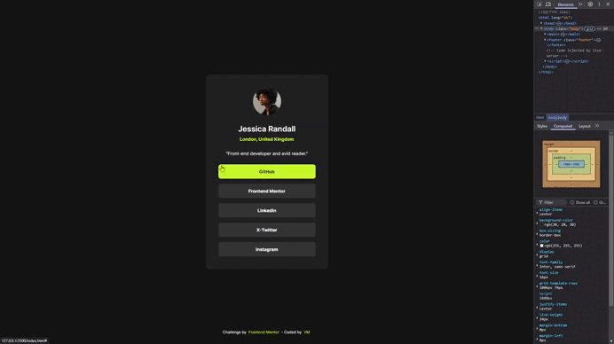

# Frontend Mentor - Social links profile solution

This is a solution to the [Social links profile challenge on Frontend Mentor](https://www.frontendmentor.io/challenges/social-links-profile-UG32l9m6dQ). Frontend Mentor challenges help you improve your coding skills by building realistic projects. 

## Table of contents

🔳 [The challenge](#the-challenge-muscle)

🔳 [Screenshots](#screenshot-camera)

🔳 [Links](#links-link)

🔳 [Built with](#built-with-hammer_and_pick)

🔳 [Author](#author-beginner)

## The challenge :muscle:

Users should be able to:

🎯 See hover and focus states for all interactive elements on the page

## Screenshot :camera:

### 📱 Mobile

### 💻 Desktop

## Links :link:

[Live site](https://mendezpvi.github.io/fem-social-links-profile/) 👈

[Solution on Frontend Mentor](https://www.frontendmentor.io/solutions/social-links-profile-0Ipy0EoHXH) 👈

[Frontend Mentor Project Showcase](https://github.com/mendezpvi/frontend-mentor-showcase) 👈

## Built with :hammer_and_pick:

📌 Semantic HTML5 markup

📌 Mobile-first workflow

📌 CSS custom properties

📌 CSS utility classes

📌 CSS Grid

## Author :beginner:

✨ Frontend Mentor - [@mendezpvi](https://www.frontendmentor.io/profile/mendezpvi)

✨ X-Twitter - [@mendezpvi](https://x.com/mendezpvi)
